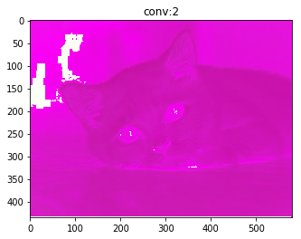
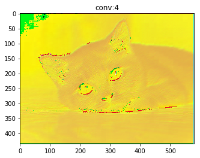
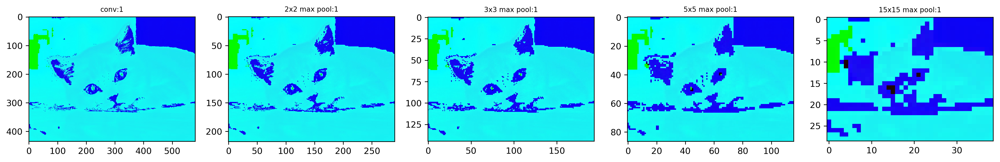
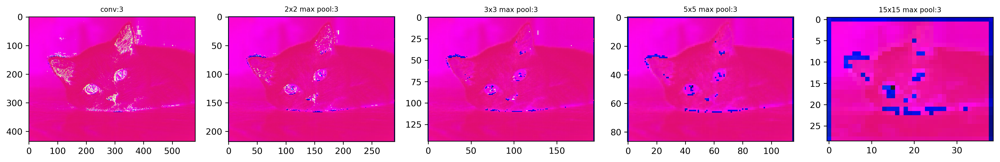
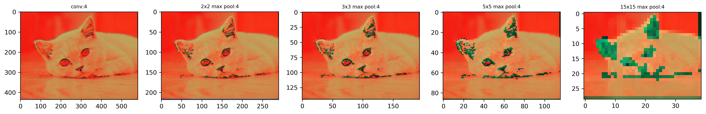
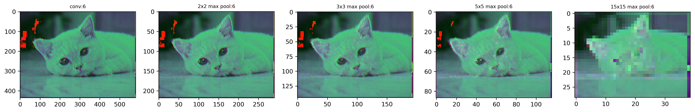
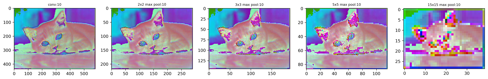

## TensorFlow CNN操作测试


```python
# utf-8
import tensorflow as tf
import numpy as np
import matplotlib.pyplot as plt
import math

```

### 1)一些可能经常使用到的方法


```python
# 权重值的初始化
def weight_variable(shape):
    initial = tf.truncated_normal(shape,stddev=0.1)
    return tf.Variable(initial)

# 偏好值初始化
def bias_variable(shape):
    initial=tf.constant(0.1,shape=shape)
    return tf.Variable(initial)

# 卷积过程
def conv2d(x,W):
    return tf.nn.conv2d(input=x,filter=W,strides=[1,1,1,1],padding='SAME')

# 池化过程
def max_pool_2x2(x):
    return tf.nn.max_pool(x,ksize=[1,2,2,1],
                         strides=[1,2,2,1],padding='SAME')

def max_pool_3x3(x):
    return tf.nn.max_pool(x,ksize=[1,3,3,1],
                         strides=[1,3,3,1],padding='SAME')
def max_pool_5x5(x):
    return tf.nn.max_pool(x,ksize=[1,5,5,1],
                         strides=[1,5,5,1],padding='SAME')
def max_pool_15x15(x):
    return tf.nn.max_pool(x,ksize=[1,15,15,1],
                         strides=[1,15,15,1],padding='SAME')

```

### 2)读取一张小猫的图片


```python
cat = tf.gfile.FastGFile('images/timg.jpg','rb').read()
image = tf.image.decode_jpeg(cat)
```

### 3)因为是tensorflow读的，所以使用的使用需要用session


```python
with tf.Session() as sess:
    #输出图像的大小（高，长，通道数）
    print(image.eval().shape)
    plt.figure(1)
    plt.imshow(image.eval())
    
```

    (435, 580, 3)
    


### 4)单步测试，大概的流程就是下面的语句


```python
# image = tf.cast(image,tf.float32)
# cat_batch = tf.reshape(image,[1,435,580,3])
# W = weight_variable([3,3,3,3])
# op = tf.nn.conv2d(cat_batch, W, strides=[1, 1, 1, 1], padding='SAME',use_cudnn_on_gpu=False)
# conv =tf.reshape(tf.cast(op,tf.uint8),[435,580,3])
```

### 5)测试部分写成了一个方法


```python
def conv_test(image,batch):
    #图片读取的时候，数据类型是tf.uint8，需要进行一下转换
    image = tf.cast(image,tf.float32)
    
    #并将图片的维度进行调整
    cat_batch = tf.reshape(image,[1,435,580,3])
    
    #设定卷积层的大小，batch随意，第一个3表示通道数，因为图片是用rbg表示，所以是三通道，第二个3是输出的层数，也就是想要生成多少个卷积池
    #这里用的是3个，因为刚好经过一步卷积之后，维度还是三维，可以直接以图像的形式输出，正常情况下是不需要固定为3的，其他都可以
    W = weight_variable([batch,batch,3,3])
    
    # 卷积的过程
    op = tf.nn.conv2d(cat_batch, W, strides=[1, 1, 1, 1], padding='SAME',use_cudnn_on_gpu=False)
    
    # 经过卷积生成的是tf.float32的，所以要想图像输出，需要转化为tf.uint8
    conv =tf.reshape(tf.cast(op,tf.uint8),[435,580,3])
    return conv


```

### 6) 测试，我的卷积大小从1\*1 到10\*10，分别变化后输出 


```python
mylist = []
for i in range(10):
    n=i+1
    mylist.append(conv_test(image,n))

with tf.Session() as sess:
    sess.run(tf.global_variables_initializer())
    n=0
    for i in mylist:
        n=n+1
        test = sess.run(i)
        plt.figure(n)
        plt.title('conv:{}'.format(n))
        plt.imshow(test)
  
    
```








**可以看出1\*1的就相当于是给图片打上了一层滤镜，因为相当于把里面的通道值都乘以了一个数。例如以前如果是红色（0,0,255）就会变化成（0\*X,0\*X,255\*X），就变成这个样子了**
    

### 7)卷积之后加入最大池化作用


```python
def conv_max_test(image,batch):
    #图片读取的时候，数据类型是tf.uint8，需要进行一下转换
    image = tf.cast(image,tf.float32)
    
    #并将图片的维度进行调整
    cat_batch = tf.reshape(image,[1,435,580,3])
    
    #设定卷积层的大小，batch随意，第一个3表示通道数，因为图片是用rbg表示，所以是三通道，第二个3是输出的层数，也就是想要生成多少个卷积池
    #这里用的是3个，因为刚好经过一步卷积之后，维度还是三维，可以直接以图像的形式输出，正常情况下是不需要固定为3的，其他都可以
    W = weight_variable([batch,batch,3,3])
    
    # 卷积的过程
    op = tf.nn.conv2d(cat_batch, W, strides=[1, 1, 1, 1], padding='SAME',use_cudnn_on_gpu=False)
    
    max_op_2x2 = max_pool_2x2(op)
    max_op_3x3 = max_pool_3x3(op)
    max_op_5x5 = max_pool_5x5(op)
    max_op_15x15 = max_pool_15x15(op)
    # 经过卷积生成的是tf.float32的，所以要想图像输出，需要转化为tf.uint8
    conv =tf.reshape(tf.cast(op,tf.uint8),[435,580,3])
    conv_max_2x2 = tf.reshape(tf.cast(max_op_2x2,tf.uint8),[math.ceil(435/2),math.ceil(580/2),3])
    conv_max_3x3 = tf.reshape(tf.cast(max_op_3x3,tf.uint8),[math.ceil(435/3),math.ceil(580/3),3])
    conv_max_5x5 = tf.reshape(tf.cast(max_op_5x5,tf.uint8),[math.ceil(435/5),math.ceil(580/5),3])
    conv_max_15x15 = tf.reshape(tf.cast(max_op_15x15,tf.uint8),[math.ceil(435/15),math.ceil(580/15),3])
    return conv,conv_max_2x2,conv_max_3x3,conv_max_5x5,conv_max_15x15
```


```python

mylist = []
taglist = ['conv','2x2 max pool','3x3 max pool' ,'5x5 max pool','15x15 max pool']
for i in range(10):
    n=i+1
    mylist.append(conv_max_test(image,n))

with tf.Session() as sess:
    sess.run(tf.global_variables_initializer())
    n=0
    for i in mylist:
        n=n+1
        test= sess.run(i)
        plt.figure(n,figsize=(20,5), dpi=300)

        for j in range(5):
            ax = plt.subplot2grid((1, 5), (0, j), colspan = 1, rowspan = 1)
            ax.set_title('{}:{}'.format(taglist[j],n),fontsize=8)
            ax.imshow(test[j])
            
```
















