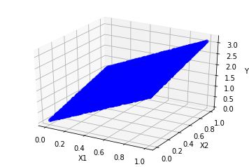
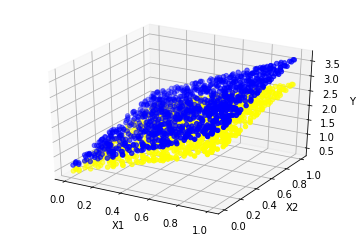

## 尝试自己做一个线性拟合的例子


```python
import tensorflow as tf
import numpy as np
import matplotlib.pyplot as plt
from mpl_toolkits.mplot3d import Axes3D

x_train =np.random.rand(10240,2)
y_train = np.dot(x_train,[2,1])+3*np.random.rand()
y_train=y_train.reshape(10240,1)
fig = plt.figure()
ax = fig.add_subplot(111, projection='3d')

ax.scatter(x_train[:,0], x_train[:,1], y_train, c='blue')

ax.set_xlabel('X1')
ax.set_ylabel('X2')
ax.set_zlabel('Y')


plt.show()

```





**从图中可以看出，这些点大概是在一个平面之上的**

$$
Y=X_1 +X_2*2 + 3
$$


```python
x = tf.placeholder('float',shape=[None,2])
y_ = tf.placeholder('float',shape=[None,1])

W = tf.Variable(tf.zeros([2,1]))
b = tf.Variable(tf.zeros([1]))

y = tf.add(tf.matmul(x,W),b)

loss = tf.reduce_mean(tf.square(tf.subtract(y,y_)))
train = tf.train.GradientDescentOptimizer(0.01).minimize(loss)
init =tf.global_variables_initializer()

# print(x_train.shape)
# print(y_train.shape)
```


```python
n=1000
x_test =np.random.rand(n,2)
y_test = np.dot(x_test,[2,1])+3*np.random.rand()
y_test = y_test.reshape(n,1)
params=tf.trainable_variables()
with tf.Session() as sess:
    sess.run(tf.global_variables_initializer())
    for i in range(1000):
        sess.run(train,feed_dict={x:x_train,y_:y_train})
        if i%100 == 0:
            print('W:{},b:{}'.format(sess.run(W),sess.run(b)))
            
    print('train:{}'.format(sess.run(loss,feed_dict={x:x_train,y_:y_train})))
    y_pred=sess.run(y,feed_dict={x:x_test})
    print('predict:{}'.format(sess.run(loss,feed_dict={x:x_test,y_:y_test})))
    y_pred2=sess.run(y,feed_dict={x:x_train})

# for i in range(len(x_test)):
#     print('{}:{}:{}'.format(x_test[i],y_test[i],y_pred[i]))
    
# for i in range(len(x_train)):
#     print('{}:{}:{}'.format(x_train[i],y_train[i],y_pred2[i]))
    
```

    W:[[0.01945166]
     [0.01766616]],b:[0.0320066]
    W:[[0.72352403]
     [0.5654643 ]],b:[0.9301649]
    W:[[0.8973408]
     [0.610165 ]],b:[0.8834947]
    W:[[1.0298028 ]
     [0.63347805]],b:[0.8037257]
    W:[[1.1449655]
     [0.6562531]],b:[0.73049814]
    W:[[1.2458932 ]
     [0.67897177]],b:[0.6647493]
    W:[[1.3344493 ]
     [0.70131683]],b:[0.6057804]
    W:[[1.4122137]
     [0.7230235]],b:[0.5528955]
    W:[[1.4805543]
     [0.7439002]],b:[0.5054674]
    W:[[1.5406597 ]
     [0.76381457]],b:[0.46293366]
    train:0.018084470182657242
    predict:0.2900586426258087
    


```python

fig = plt.figure()
ax = fig.add_subplot(111, projection='3d')

ax.scatter(x_test[:,0], x_test[:,1], y_test, c='blue',label='True')

ax.scatter(x_test[:,0], x_test[:,1], y_pred, c='yellow',label='Predict')


ax.set_xlabel('X1')
ax.set_ylabel('X2')
ax.set_zlabel('Y')


plt.show()
```




