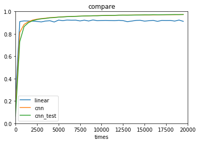
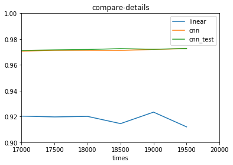

# Tensorflow基本使用

## [一个最基本的例子](http://wiki.jikexueyuan.com/project/tensorflow-zh/tutorials/mnist_pros.html)

### 1-导入数据


```python
# -*- coding:utf-8 -*-
import tensorflow as tf
from tensorflow.examples.tutorials.mnist import input_data
```

    WARNING:tensorflow:From d:\projects\jupyter_projects\venv\lib\site-packages\tensorflow\contrib\learn\python\learn\datasets\base.py:198: retry (from tensorflow.contrib.learn.python.learn.datasets.base) is deprecated and will be removed in a future version.
    Instructions for updating:
    Use the retry module or similar alternatives.
    

### 2-线性回归模型
#### 2.1-定义


```python
## 输入的x和y
x = tf.placeholder(tf.float32, [None, 784])
y_ = tf.placeholder("float", [None,10])

## 变量定义
W = tf.Variable(tf.zeros([784,10]))
b = tf.Variable(tf.zeros([10]))
y = tf.nn.softmax(tf.matmul(x,W) + b)

## 学习的方式定义（loss方法）
cross_entropy = -tf.reduce_sum(y_*tf.log(y))
train_step = tf.train.GradientDescentOptimizer(0.01).minimize(cross_entropy)

## 准确性计算
correct_prediction = tf.equal(tf.argmax(y,1), tf.argmax(y_,1))
accuracy = tf.reduce_mean(tf.cast(correct_prediction, "float"))

init = tf.global_variables_initializer()
```

#### 2.2 运行及结果


```python
linear_list=[]
x_list=[]
mnist = input_data.read_data_sets("MNIST_data/", one_hot=True)
with tf.Session() as sess:
    sess.run(init)
    for i in range(20000):
        batch_xs, batch_ys = mnist.train.next_batch(batch_size=128,shuffle=True)
        sess.run(train_step, feed_dict={x: batch_xs, y_: batch_ys})
        if i%500 == 0:
            x_list.append(i)
            acc = sess.run(accuracy, feed_dict={x: mnist.test.images, y_: mnist.test.labels})
            linear_list.append(acc)
            print('迭代次数为%d,准确性为：%.4f ' % (i,acc))
```

    WARNING:tensorflow:From <ipython-input-3-aeba3a395d22>:3: read_data_sets (from tensorflow.contrib.learn.python.learn.datasets.mnist) is deprecated and will be removed in a future version.
    Instructions for updating:
    Please use alternatives such as official/mnist/dataset.py from tensorflow/models.
    WARNING:tensorflow:From d:\projects\jupyter_projects\venv\lib\site-packages\tensorflow\contrib\learn\python\learn\datasets\mnist.py:260: maybe_download (from tensorflow.contrib.learn.python.learn.datasets.base) is deprecated and will be removed in a future version.
    Instructions for updating:
    Please write your own downloading logic.
    WARNING:tensorflow:From d:\projects\jupyter_projects\venv\lib\site-packages\tensorflow\contrib\learn\python\learn\datasets\mnist.py:262: extract_images (from tensorflow.contrib.learn.python.learn.datasets.mnist) is deprecated and will be removed in a future version.
    Instructions for updating:
    Please use tf.data to implement this functionality.
    Extracting MNIST_data/train-images-idx3-ubyte.gz
    WARNING:tensorflow:From d:\projects\jupyter_projects\venv\lib\site-packages\tensorflow\contrib\learn\python\learn\datasets\mnist.py:267: extract_labels (from tensorflow.contrib.learn.python.learn.datasets.mnist) is deprecated and will be removed in a future version.
    Instructions for updating:
    Please use tf.data to implement this functionality.
    Extracting MNIST_data/train-labels-idx1-ubyte.gz
    WARNING:tensorflow:From d:\projects\jupyter_projects\venv\lib\site-packages\tensorflow\contrib\learn\python\learn\datasets\mnist.py:110: dense_to_one_hot (from tensorflow.contrib.learn.python.learn.datasets.mnist) is deprecated and will be removed in a future version.
    Instructions for updating:
    Please use tf.one_hot on tensors.
    Extracting MNIST_data/t10k-images-idx3-ubyte.gz
    Extracting MNIST_data/t10k-labels-idx1-ubyte.gz
    WARNING:tensorflow:From d:\projects\jupyter_projects\venv\lib\site-packages\tensorflow\contrib\learn\python\learn\datasets\mnist.py:290: DataSet.__init__ (from tensorflow.contrib.learn.python.learn.datasets.mnist) is deprecated and will be removed in a future version.
    Instructions for updating:
    Please use alternatives such as official/mnist/dataset.py from tensorflow/models.
    迭代次数为0,准确性为：0.2194 
    迭代次数为500,准确性为：0.9103 
    迭代次数为1000,准确性为：0.9162 
    迭代次数为1500,准确性为：0.9150 
    迭代次数为2000,准确性为：0.9141 
    迭代次数为2500,准确性为：0.9111 
    迭代次数为3000,准确性为：0.9069 
    迭代次数为3500,准确性为：0.9148 
    迭代次数为4000,准确性为：0.9176 
    迭代次数为4500,准确性为：0.9061 
    迭代次数为5000,准确性为：0.9228 
    迭代次数为5500,准确性为：0.9185 
    迭代次数为6000,准确性为：0.9236 
    迭代次数为6500,准确性为：0.9220 
    迭代次数为7000,准确性为：0.9227 
    迭代次数为7500,准确性为：0.9158 
    迭代次数为8000,准确性为：0.9227 
    迭代次数为8500,准确性为：0.9152 
    迭代次数为9000,准确性为：0.9245 
    迭代次数为9500,准确性为：0.9182 
    迭代次数为10000,准确性为：0.9197 
    迭代次数为10500,准确性为：0.9203 
    迭代次数为11000,准确性为：0.9193 
    迭代次数为11500,准确性为：0.9185 
    迭代次数为12000,准确性为：0.9209 
    迭代次数为12500,准确性为：0.9185 
    迭代次数为13000,准确性为：0.9092 
    迭代次数为13500,准确性为：0.9145 
    迭代次数为14000,准确性为：0.9204 
    迭代次数为14500,准确性为：0.9213 
    迭代次数为15000,准确性为：0.9140 
    迭代次数为15500,准确性为：0.9177 
    迭代次数为16000,准确性为：0.9207 
    迭代次数为16500,准确性为：0.9119 
    迭代次数为17000,准确性为：0.9203 
    迭代次数为17500,准确性为：0.9197 
    迭代次数为18000,准确性为：0.9201 
    迭代次数为18500,准确性为：0.9145 
    迭代次数为19000,准确性为：0.9234 
    迭代次数为19500,准确性为：0.9120 
    

### 3-CNN模型（网上示例）
#### 3.1-方法定义


```python
# 变量定义
def weight_variable(shape):
    initial = tf.truncated_normal(shape,stddev=0.1)
    return tf.Variable(initial)

# 偏好值初始化
def bias_variable(shape):
    initial=tf.constant(0.1,shape=shape)
    return tf.Variable(initial)

# 卷积过程
def conv2d(x,W):
    return tf.nn.conv2d(input=x,filter=W,strides=[1,1,1,1],padding='SAME')

# 池化过程
def max_pool_2x2(x):
    return tf.nn.max_pool(x,ksize=[1,2,2,1],
                         strides=[1,2,2,1],padding='SAME')
# relu
def relu(x):
    return tf.nn.relu(x)

# softmax
def softmax(x):
    return tf.nn.softmax(x)
```

#### 3.2-流程定义


```python
##说明：代码在网上copy下来的，只是加了一些注释

## 需要传入的数据定义
cnn_x = tf.placeholder(tf.float32,[None,784],name='cnn_x')
cnn_y = tf.placeholder(tf.float32, [None,10],name='cnn_y')
keep_prob = tf.placeholder(tf.float32,name='keep_prob')


## 因为传入的数据为转好的列向量，需要将他转化成矩阵的形式
x_image = tf.reshape(cnn_x, [-1, 28, 28, 1])

## 第一层卷积+池化+relu
W_conv1 = weight_variable([5,5, 1,32])             # patch 5x5, in size 1, out size 32
b_conv1 = bias_variable([32])
h_conv1 = relu(conv2d(x_image, W_conv1) + b_conv1) # output size 28x28x32
h_pool1 = max_pool_2x2(h_conv1)                    # output size 14x14x32

## 第二层卷积+池化+relu
W_conv2 = weight_variable([5,5, 32, 64])                 # patch 5x5, in size 32, out size 64
b_conv2 = bias_variable([64])
h_conv2 = relu(conv2d(h_pool1, W_conv2) + b_conv2)       # output size 14x14x64
h_pool2 = max_pool_2x2(h_conv2)                          # output size 7x7x64


## 全连接层：经过卷积+池化+relu的过程之后，获得的还是很多矩阵的结果，
## 全连接层就是将矩阵的结果转化而向我们之前做的扁平化的向量
## 一共会经过两次

## 例如有两张4x4的图片，其中一共包括32个像素点（4x4x2），相当于一个大小为[1,32]矩阵，经过全连接，我们可以用一个大小为[32,x]的矩阵去作用
## 那么这个原矩阵就的大小就会变成[1,x]，x可以为任意数，如下例子就是1024

# ## 第一层
W_fc1 = weight_variable([7*7*64, 1024])
b_fc1 = bias_variable([1024])
# [n_samples, 7, 7, 64] ->> [n_samples, 7*7*64]
h_pool2_flat = tf.reshape(h_pool2, [-1, 7*7*64])
h_fc1 = relu(tf.matmul(h_pool2_flat, W_fc1) + b_fc1)

## 为了防止梯度消失，会加入dropout
h_fc1_drop = tf.nn.dropout(h_fc1, keep_prob)

# ## 第二层
W_fc2 = weight_variable([1024, 10])
b_fc2 = bias_variable([10])
prediction = tf.nn.softmax(tf.matmul(h_fc1_drop, W_fc2)+ b_fc2)

### 训练方法
cross_entropy = tf.reduce_mean(-tf.reduce_sum(cnn_y * tf.log(prediction),
                                              reduction_indices=[1]))  # loss
train_step = tf.train.GradientDescentOptimizer(1e-3).minimize(cross_entropy)

## 准确性判别方法
correct_prediction = tf.equal(tf.argmax(cnn_y,1), tf.argmax(prediction,1))
accuracy = tf.reduce_mean(tf.cast(correct_prediction, "float"))

init = tf.global_variables_initializer()
```

#### 3.3-运行及结果


```python
mnist2 = input_data.read_data_sets("MNIST_data/", one_hot=True)

cnn_list = []
with tf.Session() as sess:
    sess.run(init)    
    for i in range(20000):
        batch_xs, batch_ys = mnist2.train.next_batch(128)
        sess.run(train_step,feed_dict={cnn_x:batch_xs,cnn_y:batch_ys,keep_prob:0.5})
        if i%500 == 0:
            acc = sess.run(accuracy, feed_dict={cnn_x: mnist2.test.images, cnn_y: mnist2.test.labels, keep_prob:1})
            cnn_list.append(acc)
            print('迭代次数为%d,准确性为：%.4f ' 
                  % (i,acc))
##因为cnn中有第三个传入数据，keep_prob，所以一定要传入
```

    Extracting MNIST_data/train-images-idx3-ubyte.gz
    Extracting MNIST_data/train-labels-idx1-ubyte.gz
    Extracting MNIST_data/t10k-images-idx3-ubyte.gz
    Extracting MNIST_data/t10k-labels-idx1-ubyte.gz
    迭代次数为0,准确性为：0.1094 
    迭代次数为500,准确性为：0.8134 
    迭代次数为1000,准确性为：0.8844 
    迭代次数为1500,准确性为：0.9086 
    迭代次数为2000,准确性为：0.9235 
    迭代次数为2500,准确性为：0.9314 
    迭代次数为3000,准确性为：0.9368 
    迭代次数为3500,准确性为：0.9404 
    迭代次数为4000,准确性为：0.9452 
    迭代次数为4500,准确性为：0.9476 
    迭代次数为5000,准确性为：0.9499 
    迭代次数为5500,准确性为：0.9529 
    迭代次数为6000,准确性为：0.9548 
    迭代次数为6500,准确性为：0.9554 
    迭代次数为7000,准确性为：0.9574 
    迭代次数为7500,准确性为：0.9588 
    迭代次数为8000,准确性为：0.9594 
    迭代次数为8500,准确性为：0.9607 
    迭代次数为9000,准确性为：0.9621 
    迭代次数为9500,准确性为：0.9632 
    迭代次数为10000,准确性为：0.9639 
    迭代次数为10500,准确性为：0.9647 
    迭代次数为11000,准确性为：0.9651 
    迭代次数为11500,准确性为：0.9659 
    迭代次数为12000,准确性为：0.9671 
    迭代次数为12500,准确性为：0.9675 
    迭代次数为13000,准确性为：0.9677 
    迭代次数为13500,准确性为：0.9678 
    迭代次数为14000,准确性为：0.9689 
    迭代次数为14500,准确性为：0.9689 
    迭代次数为15000,准确性为：0.9689 
    迭代次数为15500,准确性为：0.9695 
    迭代次数为16000,准确性为：0.9698 
    迭代次数为16500,准确性为：0.9705 
    迭代次数为17000,准确性为：0.9707 
    迭代次数为17500,准确性为：0.9712 
    迭代次数为18000,准确性为：0.9713 
    迭代次数为18500,准确性为：0.9712 
    迭代次数为19000,准确性为：0.9720 
    迭代次数为19500,准确性为：0.9726 
    

### 4-CNN模型（自己胡乱构造）
#### 4.1-方法定义（略）
>方法可以直接使用之前CNN的方法，只是需要修改流程就可以了
#### 4.2-流程定义


```python
cnn_x = tf.placeholder(tf.float32,[None,784],name='cnn_x')
cnn_y = tf.placeholder(tf.float32, [None,10],name='cnn_y')
## 自己就不加keep_prob，因为不知道影响有多大


image = tf.reshape(cnn_x,shape=[-1,28,28,1])

w_1 = weight_variable([3,3,1,7])
## 没有加bias，而且修改了卷积的大小，输出减少为7
h_1 = relu(max_pool_2x2(conv2d(image,w_1)))


w_2 = weight_variable([5,5,7,64])
h_2 = relu(max_pool_2x2(conv2d(h_1,w_2)))


w_fc1 = weight_variable([7*7*64,1024])
b_fc1 = bias_variable([1024])
h_2_flat = tf.reshape(h_2, [-1, 7 * 7 * 64])
h_fc1 = tf.nn.relu(tf.matmul(h_2_flat, w_fc1) + b_fc1)


#全连接层fc2
W_fc2 = weight_variable([1024, 10])
b_fc2 = bias_variable([10])
# 直接经过softmax进行分类
prediction = tf.nn.softmax(tf.matmul(h_fc1, W_fc2) + b_fc2)

correct_prediction = tf.equal(tf.argmax(cnn_y,1), tf.argmax(prediction,1))
accuracy = tf.reduce_mean(tf.cast(correct_prediction, "float"))


cross_entropy = tf.reduce_mean(-tf.reduce_sum(cnn_y * tf.log(prediction),
                                              reduction_indices=[1]))  # loss
train_step = tf.train.GradientDescentOptimizer(1e-3).minimize(cross_entropy)
init = tf.global_variables_initializer()
```

#### 4.3-运行及结果


```python
mnist3 = input_data.read_data_sets("MNIST_data/", one_hot=True)
cnn2_list = []
with tf.Session() as sess:
    sess.run(init)    
    for i in range(20000):
        batch_xs, batch_ys = mnist3.train.next_batch(128)
        test=sess.run(train_step,feed_dict={cnn_x:batch_xs,cnn_y:batch_ys})
        if i%500 == 0:
            acc = sess.run(accuracy, feed_dict={cnn_x: mnist3.test.images, cnn_y: mnist3.test.labels})
            cnn2_list.append(acc)
            print('迭代次数为%d,准确性为：%.4f '
                  % (i,acc))

```

    Extracting MNIST_data/train-images-idx3-ubyte.gz
    Extracting MNIST_data/train-labels-idx1-ubyte.gz
    Extracting MNIST_data/t10k-images-idx3-ubyte.gz
    Extracting MNIST_data/t10k-labels-idx1-ubyte.gz
    迭代次数为0,准确性为：0.0635 
    迭代次数为500,准确性为：0.7312 
    迭代次数为1000,准确性为：0.8651 
    迭代次数为1500,准确性为：0.9000 
    迭代次数为2000,准确性为：0.9181 
    迭代次数为2500,准确性为：0.9280 
    迭代次数为3000,准确性为：0.9347 
    迭代次数为3500,准确性为：0.9380 
    迭代次数为4000,准确性为：0.9436 
    迭代次数为4500,准确性为：0.9456 
    迭代次数为5000,准确性为：0.9498 
    迭代次数为5500,准确性为：0.9512 
    迭代次数为6000,准确性为：0.9541 
    迭代次数为6500,准确性为：0.9554 
    迭代次数为7000,准确性为：0.9567 
    迭代次数为7500,准确性为：0.9583 
    迭代次数为8000,准确性为：0.9602 
    迭代次数为8500,准确性为：0.9609 
    迭代次数为9000,准确性为：0.9621 
    迭代次数为9500,准确性为：0.9617 
    迭代次数为10000,准确性为：0.9636 
    迭代次数为10500,准确性为：0.9648 
    迭代次数为11000,准确性为：0.9653 
    迭代次数为11500,准确性为：0.9655 
    迭代次数为12000,准确性为：0.9671 
    迭代次数为12500,准确性为：0.9676 
    迭代次数为13000,准确性为：0.9671 
    迭代次数为13500,准确性为：0.9678 
    迭代次数为14000,准确性为：0.9683 
    迭代次数为14500,准确性为：0.9689 
    迭代次数为15000,准确性为：0.9703 
    迭代次数为15500,准确性为：0.9700 
    迭代次数为16000,准确性为：0.9715 
    迭代次数为16500,准确性为：0.9709 
    迭代次数为17000,准确性为：0.9712 
    迭代次数为17500,准确性为：0.9716 
    迭代次数为18000,准确性为：0.9719 
    迭代次数为18500,准确性为：0.9726 
    迭代次数为19000,准确性为：0.9721 
    迭代次数为19500,准确性为：0.9727 
    


```python
import matplotlib.pyplot as plt
import pandas as pd

plt.figure(figsize=(50,25),dpi=300)

data = pd.DataFrame([x_list,linear_list,cnn_list,cnn2_list]).T
data.columns=['times','linear','cnn','cnn_test']


data.plot(x='times',xlim=(0,20000),ylim=(0,1),title='compare')


plt.show()
```


    <Figure size 15000x7500 with 0 Axes>





```python
data.plot(x='times',xlim=(17000,20000),ylim=(0.9,1),title='compare-details')
plt.show()
```




